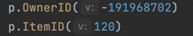

# VK RANDOMIZER CLI BOT 
***
This CLI app was built for VK like contests. By this application you can pick a winner just by "post_id" and "owner_id". Of course, access token is needed too.

This app returning a result in console.

***

__Example of a result:__

***

### How to use a bot

1. Create ".env" file and set your token
2. Paste your "owner_id" + "item_id"
   

3. Set your requirements by flag -winners="number of winners" (run flag -help for help))

4. Enjoy the result!
***
### Future plans 

* Implementing better logic for required variables (scan it from a console)
* Other filters (comments, reposts and etc.)

***
### Stack:
* Vk api sdk 
* viper 

